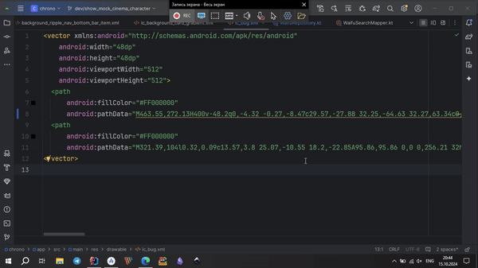

# ZSvgLongPathPlugin

### Description

A plugin to eliminate the long path in svg images that the studio warns you about. 

Unlike other plugins, the logic of this plugin is to split a long path into multiple path tags, if the original path can be split into several by Z or M characters.

### Getting Started

#### How to use?
- Select path tag with long path warning
- Right click on mouse
- In dropdown context menu select plugin action

### Restrictions
Unsupported multi cursor! Also, you need to select tag. Look at the gif.

### Why plugin work finish, but long path still warn?
Maybe you path doesn't contain enough Z or M commands or selection is wrong. You can contact with me via email if you think that bug in logic.

### Why a plugin is not a silver bullet?
The plugin is a workaround to the studio warning and doesn't really affect anything except the path size.

### Open for revisions
If you need additional functionality, email me or make a pool requester on github :)